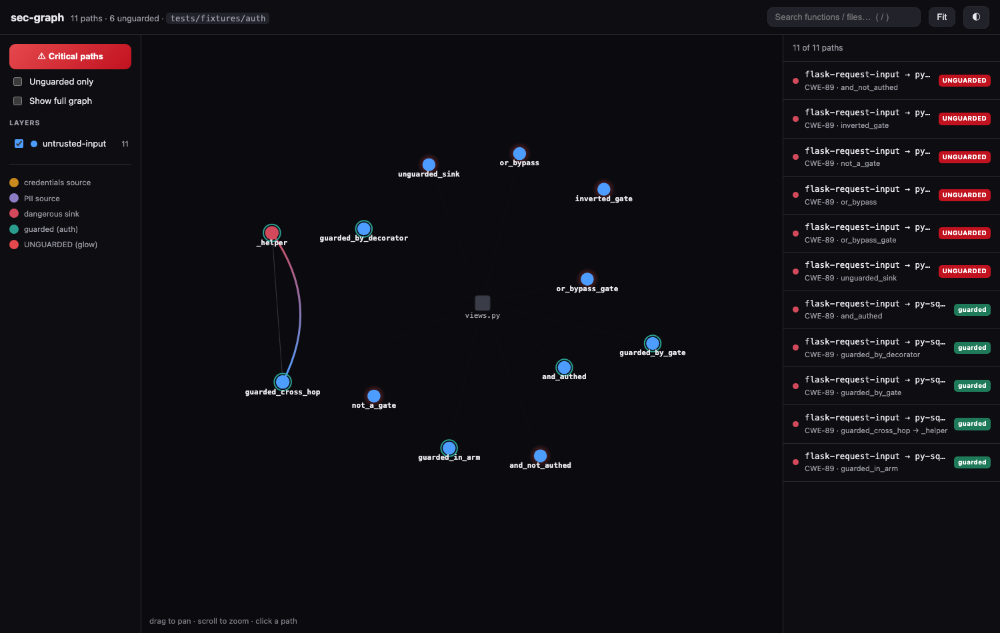
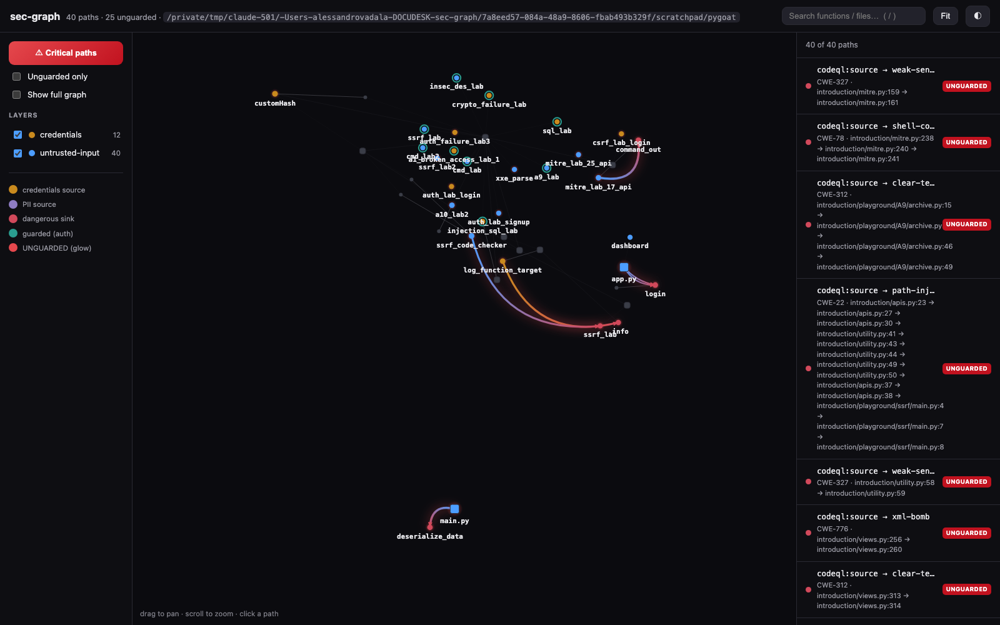
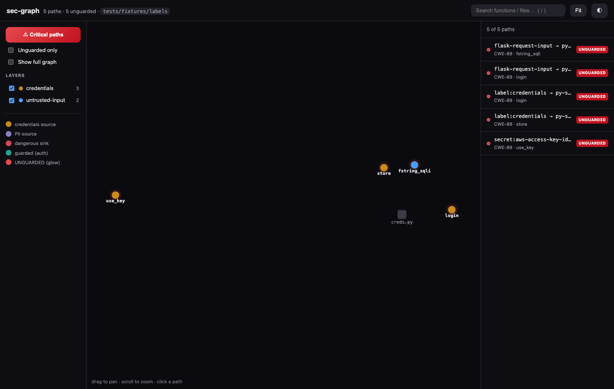

# sec-graph

**An interactive security map + local‑LLM triage layer over *any* SAST.**

sec-graph is **not another taint engine.** It takes the findings your existing static analyzer already
produces — **CodeQL, Semgrep, Bandit, anything that emits SARIF** — binds them to a code map, **enriches
them with two layers no engine ships** (a *credentials / PII* layer and an *auth / unguarded* verdict),
and hands each finding to **your own local LLM over MCP** as a minimal, hash‑verified source→sink slice
for triage. Everything runs locally and deterministically; no finding data leaves your machine.

Built on [graphify](https://github.com/safishamsi/graphify) (MIT). A small built‑in Python taint engine
is kept as the **fallback** for when you don't have a SARIF report — it is not the product.



*The layer no SAST ships: **red glow = a dangerous sink reachable with no auth barrier** (triage these
first) · **green ring = the same sink behind a real auth check**. Colour = data layer; the right‑hand
sidebar carries each finding's CWE + the hash‑verified source→sink slice an LLM triage call receives.*

## Why

Mature SAST engines are very good at *finding* data‑flows and very bad at two things a human (or an LLM)
actually needs to triage them: **"is this reachable without authentication?"** and **"does this path
touch a credential/PII?"** — plus they dump raw findings with no cheap way to feed just the relevant code
to a model. sec-graph adds exactly those, on top of whatever engine you already run.

## Does it actually help? (an honest benchmark)

We pre‑registered and ran a control‑vs‑treatment benchmark — a local **Gemma 3n E4B** triaging the same
66 CodeQL findings on three deliberately‑vulnerable Python apps, **whole‑file context vs sec-graph's MCP
slices**, scored against hand‑labelled, independently‑audited ground truth. The honest result:

- **The robust win is efficiency** — sec-graph's minimal slices matched whole‑file triage quality at
  **~1/7th the prompt tokens** and **~half the wall‑time** (12× fewer tokens per finding on large files).
  That's what makes per‑finding triage cheap enough to run on a local model.
- **Accuracy: a small, statistically‑inconclusive, repo‑dependent edge** (real/FP +6 pts pooled, not
  significant) — reported as a signal, not a result.
- **The self‑audit is honest about a limitation.** sec-graph's `unguarded` verdict over‑reports (56%
  precision) when an app uses a *custom* auth decorator/callable not in the default barrier list, or a
  guard in a *calling* function — though it *never* falsely claims `guarded` (100%). That's
  configuration + a future interprocedural improvement, published, not buried.

Full methodology, numbers, and a "when it helps / when it doesn't" table: **[benchmark/BENCHMARK.md](benchmark/BENCHMARK.md)** ·
pre‑registration: **[benchmark/PROTOCOL.md](benchmark/PROTOCOL.md)**.



*On a real repo (PyGoat + CodeQL's 40 findings): most web‑app findings are intra‑function, so the map is
a constellation of `unguarded` hotspots rather than long routes — the enriched sidebar is the workhorse
there, and the graph earns its keep on cross‑function/cross‑file data‑flow. Honest by design.*

## Install

```bash
pip install -e .          # or: uv pip install -e .
secgraph --version
```

Requires Python ≥ 3.11. Pulls `graphify`, `tree-sitter`, `mcp`, `typer`, `pyyaml`.

## Quickstart

```bash
# 1. run your SAST and export SARIF
codeql database create db --language=python && \
codeql database analyze db --format=sarif-latest -o findings.sarif \
    codeql/python-queries:codeql-suites/python-security-extended.qls
#   (or)  semgrep scan --sarif -o findings.sarif

# 2. bind + enrich + map
secgraph analyze ./my-app --sarif findings.sarif   # -> graph.json, taint.json, secgraph.html
secgraph view                                       # open the interactive layered map

# 3. triage with your own LLM over MCP
secgraph serve                                      # read-only MCP server (stdio)
```

No SARIF? `secgraph analyze ./my-app` runs the built‑in Python fallback engine instead.

## How it works

1. **Ingest** — parse SARIF (`results` + `codeFlows`) or Semgrep JSON into one normalized finding, bound
   to the code graph *structurally* (by `(file, def‑line)` span, never by name).
2. **Enrich** — add, per finding: **sensitive‑data layers** (credentials/PII identifiers & secret
   patterns on the tool‑verified flow lines) and, for Python sinks, an **auth/unguarded verdict** from a
   structural guard analysis, with an honest tri‑state (`analyzed` / `unknown` — never a false "guarded").
3. **Map** — a self‑contained, deterministic force‑directed HTML map: colour = data layer, red glow =
   `unguarded`, a one‑click "Critical paths" preset.
4. **Triage over MCP** — `secgraph serve` exposes read‑only tools (`list_paths`, `get_path_slice`,
   `find_unguarded_sinks`, `explain_layer`, `get_function_taint`) that hand your LLM the **minimal,
   hash‑verified** code windows for a path — never the whole repo. Run it alongside `graphify --mcp`
   (entity‑level questions stay with graphify; data‑flow paths are ours).



*Enrichment in action (`credentials` + `untrusted-input` layers): a hard‑coded `secret:aws-access-key-id`
and `credentials`‑tagged data‑flows in amber — surfaced from the same findings, with tags no engine emits.*

The analysis core is deterministic — **no LLM on the critical path**; `analyze` twice is byte‑identical.

## Scope & honest limits

sec-graph is **bounded by your upstream SAST's recall** — it adds no findings the engine missed. The
enrichment is *lexical* (identifier/secret patterns on a proven flow), stronger than grep but weaker than
value‑tracking taint. The auth verdict and the built‑in engine are **Python‑only**; other languages get
the map + slices but a `guard_status: unknown`. See BENCHMARK.md for the measured weaknesses (including a
current guard‑analysis bug); the licence/scope notes for each engine are in `docs/`.

## Development

```bash
uv pip install -e ".[dev]"
pytest                 # 121 tests
pytest tests/contract  # the graphify contract test
```

Architecture: `docs/architecture.md` · contributing: `CONTRIBUTING.md`.

## License & credits

**MIT** (see `LICENSE`). Built on **graphify** (MIT); parses **CodeQL** / **Semgrep** SARIF; uses
**tree-sitter**. sec-graph ships no third‑party code — those are runtime dependencies / input formats.

## Responsible use

Defensive and static only — sec-graph exploits nothing and ships no exploit code; the MCP triage prompts
enforce a defensive framing. Audit code you own or are authorized to review, and practice coordinated
disclosure. Do not use it to mass‑scan third‑party code and publish 0‑days.
